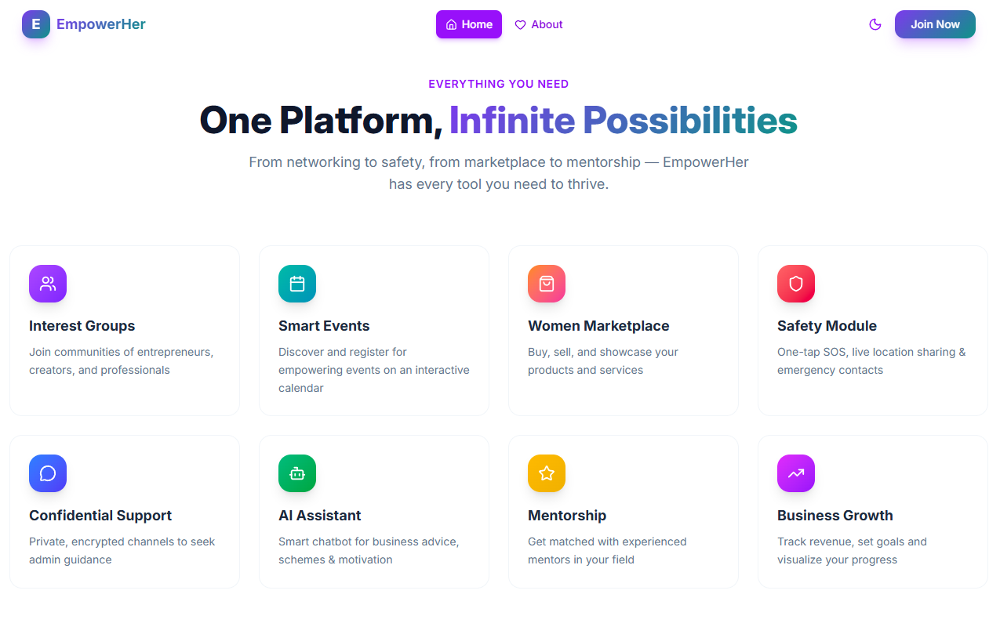
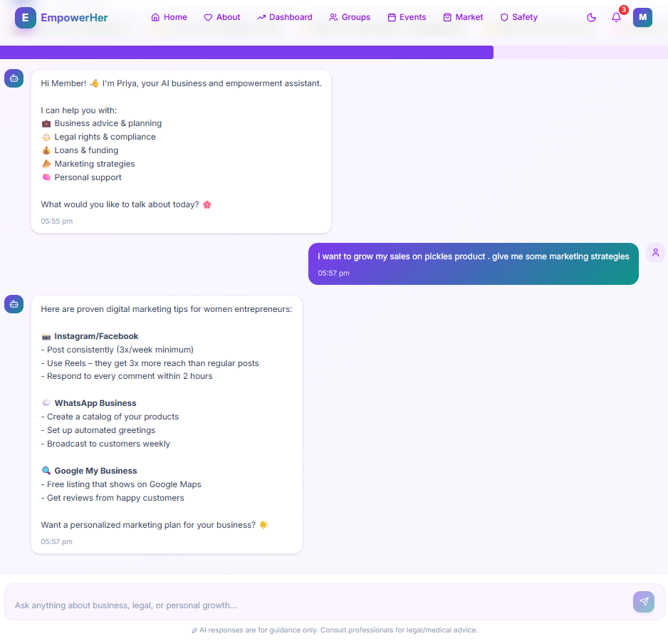
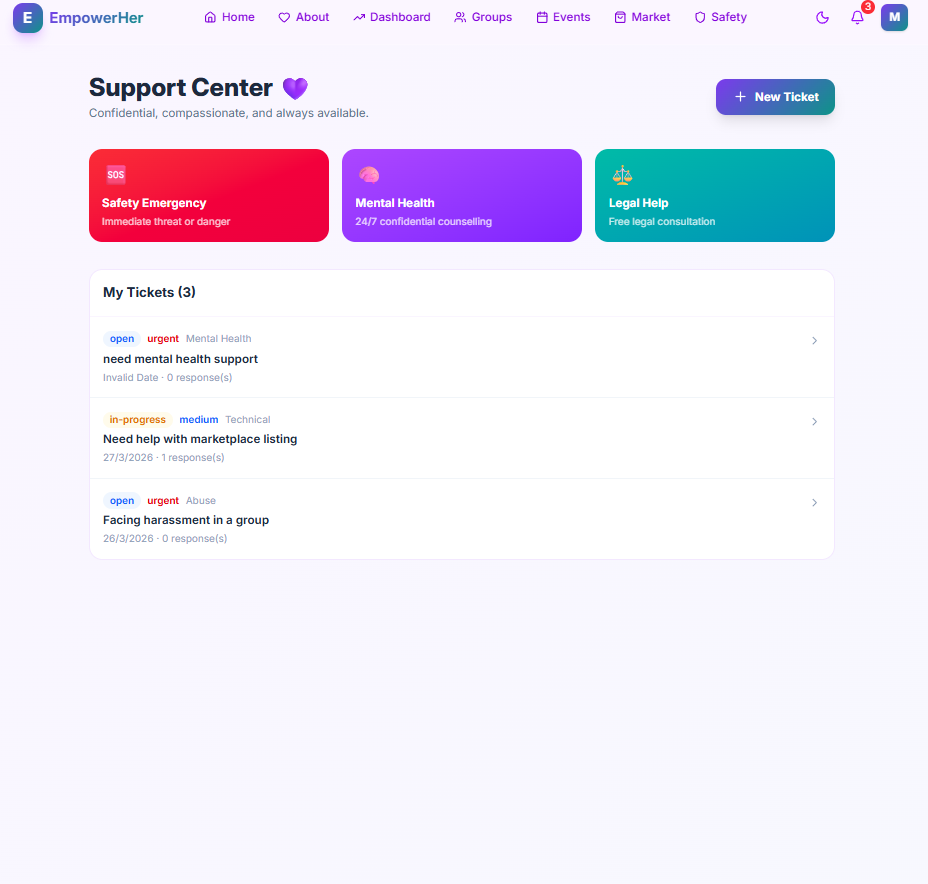
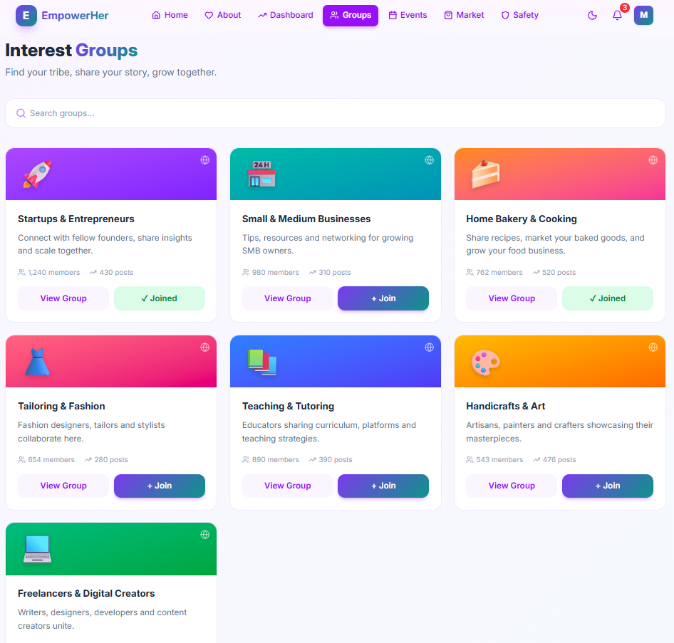
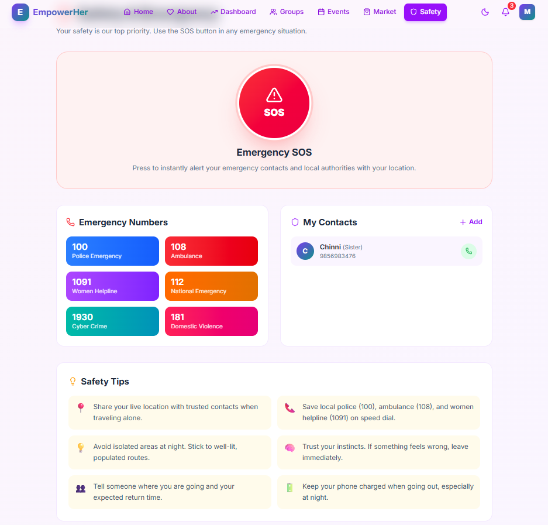

# 🌸 EmpowerHer – Smart Women Empowerment Platform

EmpowerHer is a modern digital platform designed to support women through safety, networking, mentorship, and opportunities in a single unified system.

---

## 🌐 Live Demo

🚀 Try the app here:  
https://empower-her-git-main-chandana-builds-projects.vercel.app/

---

## 🚀 Features

- 🛡️ Safety alerts and emergency support  
- 🔐 Confidential ticket-based support system  
- 🤝 Networking and mentorship  
- 📚 Events, jobs, and government schemes updates  
- 🤖 AI-based assistance and recommendations  
- 🔑 Secure authentication with OTP  

---

## 🏗️ Tech Stack

- Frontend: React  
- Backend: Node.js   
- Database: MongoDB  
- Deployment: Vercel (Frontend), Render (Backend)  
- APIs: Email OTP, Maps Integration  

---

## 📂 Project Structure

EmpowerHer/  
│── frontend/  
│── backend/  
│── README.md  

---

## ⚙️ Installation & Setup

Clone the repository:

git clone https://github.com/your-username/empowerher.git  
cd empowerher  

Run backend:

cd backend  
npm install  
npm run dev  

Run frontend:

cd frontend  
npm install  
npm run dev  

---

## 📸 Screenshots

  
  
  
  
  

---

## 💡 Future Enhancements

- 🎤 Secret voice-based emergency alert system  
- 📍 Location-based service search using maps  
- 🔔 Personalized job & scheme notifications  
- ⌚ Smartwatch integration for health monitoring  

---

## 📄 License

This project is for educational purposes.

---

## 🙌 Acknowledgements

Thanks to all contributors and supporters.
